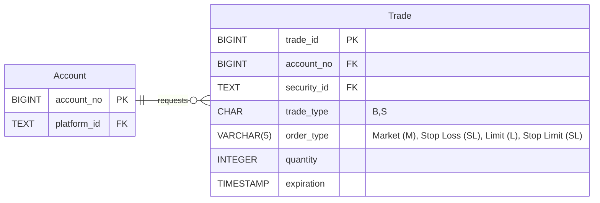

# Data Models for Trade-Instructions-Capture-Svc

## Canonical


## Trade Req.
```json
{
    "platform_id": "ACCT123456",
    "account_no": "1234567890",
    "security_id": "SPY",
    "trade_type": "Buy",
    "order_type": "Market",
    "quantity": 1024,
    "expiration": "2025-10-28T20:00:00Z"
}
```

## Platform Trade

```json
{
    "platform_id": "ACCT123",
    "trade": {
        "account": "****1234",
        "security": "SPY",
        "type": "B",
        "amount": 100000,
        "timestamp": "2025-08-04T21:15:33Z"
    }
}
```